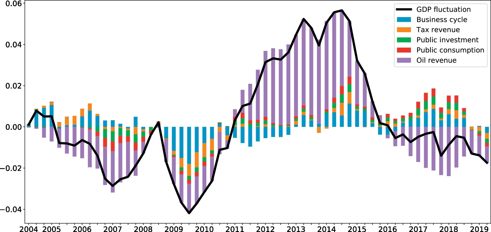

```{r setup, include=FALSE}
knitr::opts_chunk$set(
  echo    = TRUE,          # show code; hide if not needed
  message = FALSE,
  warning = FALSE
)
```

## Packages

```{r package, message=FALSE, warning=FALSE}
library(lubridate)
library(ggplot2)
library(forecast)  
library(Kendall)
library(tseries)
library(outliers)
library(tidyverse)
library(smooth)
library(zoo)
library(kableExtra)
library(readxl)
library(writexl)
library(ggplotify)
library(janitor)
```

## Directory

```{r}
base_dir <- "D:/Geani/Box/Home Folder gnl13/Private/1 Academics/3 Time series/LeinesMartinez_ENV797_TSA_FinalProject" # Update this
data_dir <- file.path(base_dir, "Data")
output_dir <- file.path(base_dir, "Output")
images_dir <-file.path(base_dir, "Images")

file1 <- "oil_production_EC_2007_2024.xlsx"
file2 <- "oil_price_2007-2024.xlsx"
file3 <- "annual_oil_production_1972-2023.xlsx"
file4 <- "oil_data_2007_2024.xlsx"

file_path1 <- file.path(data_dir, file1)
file_path2 <- file.path(data_dir, file2)
file_path3 <- file.path(data_dir, file3)
file_path4 <- file.path(data_dir, file4)

oil_production <- read_excel(file_path1) %>% clean_names()
oil_prices <- read_excel(file_path2) %>% clean_names()
annual_oil_production <- read_excel(file_path3) %>% clean_names()
oil_data <- read_excel(file_path4) %>% clean_names()

```

## Introduction

Ecuador's economy has been heavily reliant on oil exploitation for over five decades. As is shown in [@garcia-alban_good_2021] a result, the oil revenue is the most important driver of the national GDP.



## Motivation

-   The oil well known as Block 43-ITT is located within Ecuador’s Yasuní National Park—one of the most biodiverse places on Earth and home to Indigenous communities [@unescoMainInitiativesYasuni2024].

-   Oil exploitation in that well began in 2016 as part of efforts to boost fiscal revenues [@banco_central_del_ecuador_estudio_2023].

-   In the 2023 national referendum, the Ecuadorian population voted to halt extraction in that well [@corteconsitutionaldelecuadorCaseNo622CP2023]. ​

-   The decision was driven by the growing environmental and Indigenous rights movement and marked a significant shift in Ecuador’s natural resource policy.​

## Relevance

The government is now responsible for phasing out extraction while addressing the economic implications—especially those related to oil production levels and public revenues.​ Evaluating how reduced production affects overall output is critical for policy and planning future decisions on resource management.

## Objectives

-   This final project aims to forecast oil production in Ecuador for the forthcoming years, following the halt of extraction in Block 43-ITT, which raises questions about future national income.​

## Dataset information

-   Our dataset has monthly information from 2007-2024 for oil production: ​

    -   Total and disaggregated for Block 43-ITT (from 2016 to 2023) and for the rest of the wells (data provided by the Government of Ecuador).​

-   Annual oil barrel production for 1972-2024 + 2025-2029 expected production (public data).​

-   WTI monthly prices for 2007-2024.

## Analysis (Methods and Models)

-   **Stage A** (Annual-Level Analysis):​

    -   We use an annual series (1972–2024) to analyze the long-run production trend.

-   **Stage B** (Monthly-Level Analysis)​

    -   We use monthly dataset (2007–2024) for a more detailed (higher-frequency) forecast.​

    -   Additional variables:​

        -   Monthly WTI prices​

        -   Monthly block-level production of Block 43 ITT.

-   **Stage C** (Scenario analysis)​

    The idea is that if we trust the long-run historical trend from the annual model, we can ensure that the sum our monthly forecasts matches the trend predicted by the annual model. ​

    -   **Baseline forecast:** assuming Block 43 ITT continues as historical.​

    -   **Shutdown Scenario:** set Block 43 ITT output to zero in 2024.​

The difference in total production between the baseline and shutdown forecasts is the gap that other blocks must fill to maintain the same output level.​

### Wrangling data

```{r AnnualData, echo=F, results='hide', warning=FALSE}


annual_data_72_2023 <- annual_oil_production |>
  slice(-1:-14) |>               
  select(2, 8) |>                     
  setNames(c("year", "annual_production")) |> 
  filter(!(is.na(year) & is.na(annual_production))) %>%
  mutate(
    year = as.numeric(year),
    annual_production = as.numeric(annual_production),
    annual_production = as.numeric(annual_production) * 1000 
  )

output_file1 <- file.path(output_dir, "oil_data_72_2023.xlsx")
write_xlsx(annual_data_72_2023, path = output_file1)

```

### Stage A (Annual-Level Analysis):

We used an annual series (1972–2024) to analyze the long-run production trend.​

#### Annual Data

The chart below illustrates the trajectory of Ecuador’s annual oil output, which surged dramatically from the 1970s through the early 2000s. Following this period of rapid growth, production plateaued but remained substantially higher than pre-2000 levels. By the early 2020s, output had gradually declined to around 170 million barrels, possibly influenced by aging fields, constrained investment, the effects of the pandemic, or a combination of all. 

The solely visualization may suggest that including data from before 2000 —when output was only a fraction of its subsequent levels— could distort our model’s parameters. In contrast, restricting the sample to the period from 2000 onward, when production stabilized at its modern scale, is likely to yield a more accurate and relevant time series and forecasts. Considering this, analyzing the Autocorrelation Function (ACF) and Partial Autocorrelation Function (PACF) could provide valuable insights for determining the most appropriate research period, helping to identify patterns and lags in the data.

```{r TSAnnual, echo=F, warning=FALSE}
annual_ts <- ts(annual_data_72_2023[,2],
                start = c(1972, 1),
                frequency = 1)
p1 <- autoplot(annual_ts)
print(p1)
```

The sample ACF for the full series reveals strong autocorrelation extending up to approximately the 15 lag, beyond which the correlations sharply diminish, falling within the significance bounds for several years. This decline signals that the pre-2000 data may not exhibit meaningful memory. Similarly, the PACF presents a single significant spike at lag 1, which may suggest an AR(1) structure for the series.

From that information and given that pre-2000 output levels are an order of magnitude lower than post-2000 production and introduce disruptive long-lag noise, we confined our model to the 2000–2023 period, aiming at the model to gain precision and isolating the data’s most relevant structural characteristics.

```{r plotACFPACF, echo=F, warning=FALSE}

#Plot of ACF and PACF together

old_par <- par(no.readonly = TRUE)

# set up 1 row, 2 columns
par(mfrow = c(1, 2))
annual_acf <- acf(annual_ts, lag = 51, plot = TRUE,main="")
annual_pacf <- pacf(annual_ts, lag = 51, plot = TRUE,main="")
par(old_par)
```

All the annual forecasting models were trained using data up to the year 2020. Because when using the pre-pandemic period, forecast performed poorly (see Annex).

```{r training, echo=F, warning=FALSE}

#training
annual_ts_train <- window(annual_ts,
                          start= c(2000,1),
                end= c(2020, 1),
                frequency = 1)

ts_daily_test <- window(annual_ts,
                start= c(2021, 1),
                frequency = 1)
```


##### Model 1: ARIMA

The "auto.arima" in the training time series, suggests using the ARIMA(0,1,0) model captures the general trend of Ecuador's oil production over time but demonstrates moderate accuracy when handling the data's inherent volatility (See Table 1). With a mean absolute percent error (MAPE) of 0.94 (94% error) and RMSE of approximately 2 million units, the model's performance is acceptable but not exceptional. The forecast shows relatively stable future production levels, though the wide confidence intervals (gray bands) indicate substantial uncertainty in these predictions. The Theil's U value of 0.54 suggests that while the model outperforms naive forecasting approaches, there remains considerable room for improvement in capturing the time series' complex patterns and fluctuations.

```{r ARIMA}

#Model 1: ARIMA
# Fit an ARIMA model to the annual time series and forecast for 3 years
model_arima <- auto.arima(annual_ts_train)
forecast_arima <- forecast(model_arima, h = 3)
print(forecast_arima)

# Plot the forecast
plot(forecast_arima)


#Plot model + observed data
autoplot(annual_ts) +
  autolayer(forecast_arima, series="AutoArima",PI=FALSE) +
  ylab("Annual oil production Ecuador")

```

##### Testing Model 2:  MEAN

The Mean model employs a much simpler approach than ARIMA, that generates a flat forecast (blue dots) at approximately 181 million barrels with a wide confidence intervals, indicating high uncertainty. Besides, its performance metrics (see Table 1) reveal significant weaknesses, with a much higher RMSE (7,781,977) compared to ARIMA and a concerning MAPE of 4.42 (442% error). Moreover, according to the model's Theil's U value of 2.77 indicates it performs worse than naive forecasting methods, essentially failing to capture any of the time series' patterns or fluctuations.

```{r MEAN, echo=TRUE, message=FALSE, warning=FALSE}
#Model 2: Arithmetic mean on original data
MEAN_seas <- meanf(y = annual_ts_train, h = 3)
print(MEAN_seas)
plot(MEAN_seas)

autoplot(annual_ts) +
  autolayer(MEAN_seas, series="MEAN",PI=FALSE) +
  ylab("Production")

```

##### Testing Model 3: ETS

The ETS model effectively "locks in" the most recent observed level (approximately 175 million barrels) and extrapolates it forward, producing a flat forecast line characterized by moderately narrow confidence bands. This tighter band of uncertainty, compared to the mean model’s wider fan, reflects ETS's ability to adapt to the stable, modern production regime rather than being swayed by earlier, lower historical levels.

In-sample (see Table 1), the model under-forecasts by an average of 1.6 million barrels (ME), achieving a MAPE below 1 percent (around 0.95%). A Theil’s U statistic of 0.54 confirms that it outperforms a naive "no-change" forecast. However, the pronounced negative autocorrelation at lag 1 indicates that the ETS model struggles to capture some of the smoother, year-over-year momentum inherent in the data.

```{r ETS, echo=TRUE, message=FALSE, warning=FALSE}
# Model 3: ETS (Exponential Smoothing without seasonality)
model_ets <- ets(annual_ts_train)
forecast_ets <- forecast(model_ets, h = 3)
print(forecast_ets)

plot(forecast_ets)

autoplot(annual_ts) +
  autolayer(forecast_ets, series="ETS",PI=FALSE) +
  ylab("Production")
```
  
##### Testing Model 4: HOLT

Holt’s method augments simple exponential smoothing with a linear trend, and its forecast barely moves from the last observed level (around 175 million barrels), producing an almost flat‐looking line with even wider uncertainty bands than ETS. It stands out that its Theil’s U is 1.09, which would suggests it actually performs worse than a naïve method.

```{r Holt, echo=TRUE, message=FALSE, warning=FALSE}
# Model 4: Holt's Linear Trend method
model_holt <- holt(annual_ts_train, h = 3)
forecast_holt <- forecast(model_holt, h = 3)
print(forecast_holt)

plot(forecast_holt)

autoplot(annual_ts) +
  autolayer(forecast_holt, series="HOLT",PI=FALSE) +
  ylab("Production")
```

### Compare performance metrics of all models for the annual analysis

```{r Accuracy, echo=TRUE, message=FALSE, warning=FALSE}
#Model 1: ARIMA
ARIMA_scores <- accuracy(forecast_arima$mean,ts_daily_test)  #store the performance metrics

#Model 2: Arithmetic mean 
MEAN_scores <- accuracy(MEAN_seas$mean,ts_daily_test)

# Model 3:  ETS
ETS_scores <- accuracy(forecast_ets$mean,ts_daily_test)

# Model 4:  HOLT
HOLT_scores <- accuracy(forecast_holt$mean,ts_daily_test)

#create data frame
models_scores <- as.data.frame(rbind(ARIMA_scores, MEAN_scores,ETS_scores,HOLT_scores ))
row.names(models_scores) <- c("ARIMA", "MEAN","ETS","HOLT")
                            
```

The following table compares the mentioned models accuracy, and shows how ARIMA beats the rest of the models, while ETS is the second best model

```{r tablescores, echo=TRUE, message=FALSE, warning=FALSE}

kbl(models_scores, 
      caption = "Table 1. Forecast Accuracy for Annual Data",
      digits = array(5,ncol(models_scores))) %>%
  kable_styling(full_width = FALSE, position = "center") %>%
  #highlight model with lowest RMSE
  kable_styling(latex_options="striped", stripe_index = which.min(models_scores[,"RMSE"]))

#choose model with lowest RMSE
best_model_index <- which.min(models_scores[,"RMSE"])
cat("The best model by RMSE is:", row.names(models_scores[best_model_index,])) 

#choose model with lowest RMSE
best_model_index2 <- which.min(models_scores[,"MAPE"])
cat("The best model by MAPE is:", row.names(models_scores[best_model_index,])) 
```

Thus, we combined the two best models in aiming to have a more accurate model. By feeding the ETS errors into a simple AR(1), this hybrid forecast (red shading) sits almost exactly on today’s production level (around 175 million barrels) and produces the tightest uncertainty “cone” of all models. In back‐testing against 2021–2023 actuals (see Table 2), it under‐forecasted by only 0.66 million barrels on average (ME around –0.66 m), cutting its RMSE from ~2.0 m (pure ETS or ARIMA) down to 1.17 m and halving the MAPE to 0.54 %. The dramatic drop in MAE (to 0.93 m) and MAPE shows that capturing the year-to-year autocorrelation in the residuals yields materially more accurate point forecasts, while the narrower fan reflects increased confidence in the short‐term outlook.

```{r ETS.AR, echo=TRUE, message=FALSE, warning=FALSE}

# 1) Fit the base ETS
ets_fit <- ets(annual_ts_train)

# 2) Extract residuals and fit an AR(1) (no constant) to them
resid_ets <- residuals(ets_fit)
ar1_fit   <- Arima(resid_ets, order = c(1,0,0), include.mean = FALSE)

# 3) Forecast both models out h steps
h <- 3
ets_fc   <- forecast(ets_fit, h = h)
resid_fc <- forecast(ar1_fit, h = h)

# 4) Combine the forecasts
hybrid_fc        <- ets_fc
#colnames(hybrid_fc$lower)
#colnames(hybrid_fc$upper)
hybrid_fc$mean   <- ets_fc$mean   + resid_fc$mean
hybrid_fc$lower  <- ets_fc$lower  + resid_fc$lower
hybrid_fc$upper  <- ets_fc$upper  + resid_fc$upper

# 5) Or extract a neat table of point‐forecasts + 95% intervals:
print(colnames(hybrid_fc$lower))  # e.g. "80%" or c("80%", "95%")

# 6) Build a table by position
hybrid_df <- data.frame(
  Year     = time(hybrid_fc$mean),
  Forecast = as.numeric(hybrid_fc$mean),
  Lo80     = hybrid_fc$lower[,1],
  Hi80     = hybrid_fc$upper[,1],
  Lo95     = if(ncol(hybrid_fc$lower)>=2) hybrid_fc$lower[,2] else NA,
  Hi95     = if(ncol(hybrid_fc$upper)>=2) hybrid_fc$upper[,2] else NA
)
print(hybrid_df)

# 6) Plot the result
autoplot(annual_ts) +
  autolayer(hybrid_fc, series="ETS+AR(1)", PI=TRUE) +
  ylab("Production") +
  ggtitle("Hybrid ETS(.,.,.) + AR(1) Forecast")
  
```

```{r Accuracy2, echo=TRUE, message=FALSE, warning=FALSE}
# 1) Compute hybrid accuracy
Hyb_scores <- accuracy(hybrid_fc$mean,ts_daily_test)

# 1) bind all five score‐objects into one data.frame
models_scores2 <- as.data.frame(rbind(
  ARIMA                  = ARIMA_scores,
  MEAN                   = MEAN_scores,
  ETS                    = ETS_scores,
  HOLT                   = HOLT_scores,
  `Hybrid ETS & AR(1)`   = Hyb_scores
))

# 2) (re)name the rows for display  
rownames(models_scores2) <- c(
  "ARIMA", "MEAN", "ETS", "HOLT", "Hybrid ETS & AR(1)"
)

# 3) render the table; this must be the last expression in the chunk
models_scores2 %>%
  kbl(
    caption = "Table 2. Forecast Accuracy for Annual Data",
    digits  = array(5, ncol(models_scores2)),
    row.names = TRUE
  ) %>%
  kable_styling(full_width = FALSE, position = "center") %>%
  kable_styling(
    latex_options = "striped",
    stripe_index  = which.min(models_scores2$RMSE)
  )
print(models_scores2)

# 4) now print out which model is best by RMSE and MAPE
best_rmse <- rownames(models_scores2)[which.min(models_scores2$RMSE)]
best_mape <- rownames(models_scores2)[which.min(models_scores2$MAPE)]

cat("The best model by RMSE is:", best_rmse, "\n")
cat("The best model by MAPE is:", best_mape, "\n")
```
Now we use the hybrid model for our data from 2000 to 2023. This model captured the long-term level and then added an AR(1) on its one-step residuals to restore the small year-to-year momentum that pure ETS missed. The outcome is a flat forecast of about 173 million barrels per year from 2024 through 2027, with an 80 % confidence band narrowing to roughly 128–219 million and a 95 % band of 103–244 million barrels.

```{r}
# Filter the original from 2000 to 2023
annual_ts_2023 <- window(annual_ts, start = c(2000, 1), end = c(2023, 1))

# 1) Fit the base ETS on 2000–2023
ets_fit2   <- ets(annual_ts_2023)

# 2) Extract one‐step residuals and fit AR(1) to them
resid_ets2 <- residuals(ets_fit2)
ar1_fit2   <- Arima(resid_ets2, order=c(1,0,0), include.mean=FALSE)

# 3) Forecast each component h years ahead
h2 <- 4
ets_fc2   <- forecast(ets_fit2,   h = h2, level = c(80, 95))
resid_fc2 <- forecast(ar1_fit2,   h = h2, level = c(80, 95))
colnames(ets_fc2$lower)
colnames(resid_fc2$lower)

# 4) Build the hybrid forecast object
hybrid_fc2        <- ets_fc2
hybrid_fc2$mean   <- ets_fc2$mean   + resid_fc2$mean
hybrid_fc2$lower  <- ets_fc2$lower  + resid_fc2$lower
hybrid_fc2$upper  <- ets_fc2$upper  + resid_fc2$upper

# 5) Print the 80% and 95% intervals
hybrid_df2 <- data.frame(
  Year     = time(hybrid_fc2$mean),
  Forecast = as.numeric(hybrid_fc2$mean),
  Lo80     = hybrid_fc2$lower[, 1],  # first column = 80%
  Hi80     = hybrid_fc2$upper[, 1],
  Lo95     = hybrid_fc2$lower[, 2],  # second column = 95%
  Hi95     = hybrid_fc2$upper[, 2]
)
print(hybrid_df2)

# 6) Plot: historical 2000–2023 + 2024–2026 hybrid forecast
autoplot(annual_ts_2023) +
  autolayer(hybrid_fc2, series="ETS+AR(1)", PI=TRUE) +
  ylab("Annual Oil Production (barrels)") +
  ggtitle("Hybrid ETS(.,.,.) + AR(1) Forecast: 2000–2026")

```
The residuals fluctuate randomly around zero with no obvious drift or changing variance, and—aside from a single large error in the mid-2000s—stay within about ±20 million barrels. Moreover, the ACF shows all lags inside the 95 % confidence bounds (lag 4 is barely crossing the bounds, but we would say there is no meaningful serial correlation). The histogram of errors looks symmetric (with slightly tails from that outlier). In brief, they behave like white noise, suggesting our hybrid ETS+AR(1) captured the main dynamics of Ecuador’s oil‐production series.

```{r Residuals}
checkresiduals(hybrid_fc2)

```
Finally, we observed that Ecuador’s projected a higher production for 2026 & 2027, however, there was no information on the additional data they used for their forecasting. However it is worth noting that projections for 2026 would be historic volumes as is slightly above annual production in previous years.

```{r}
# 1. Filter existing data from 2000 to 2023
expected_production <- annual_data_72_2023 %>%
  filter(year >= 2000, year <= 2023)

# 2. Create a data frame for 2024–2027: data from https://www.primicias.ec/economia/plan-hidrocarburifero-inversiones-petroleo-gobierno-noboa-88061/
daily_values <- c(475.27, 508.09, 600.72, 539.252)  # daily production according to Ecuador's gov
future_years <- 2024:2027

df_future <- data.frame(
  year = future_years,
  annual_production = daily_values * 1000 * 365
)

# 3. Combine the filtered data with the new rows
expected_production <- bind_rows(expected_production, df_future)

annual_exp_ts <- ts(expected_production[,2],
                start = c(2000, 1),
                frequency = 1)


# 6. Plot the ARIMA forecast and government expected production together
autoplot(hybrid_fc2) +
  autolayer(annual_exp_ts, series = "Government Expected", linetype = "dashed", color = "darkblue") +
  xlab("Year") +
  ylab("Annual Production") +
  ggtitle("ARIMA Forecast vs. Government Expected Production (2024-2027)") +
  guides(colour = guide_legend(title = "Series"))

```


## Summary and Conclusions

## References


